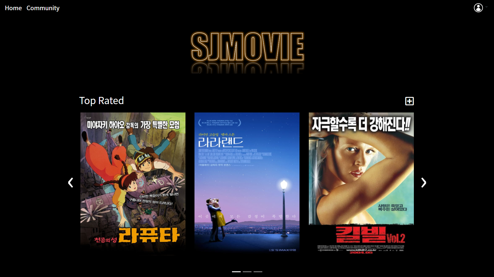
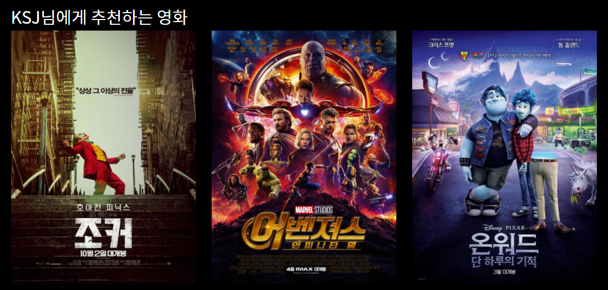
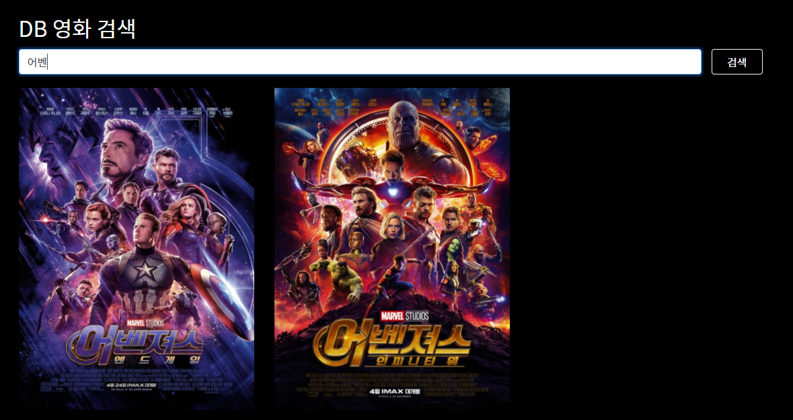
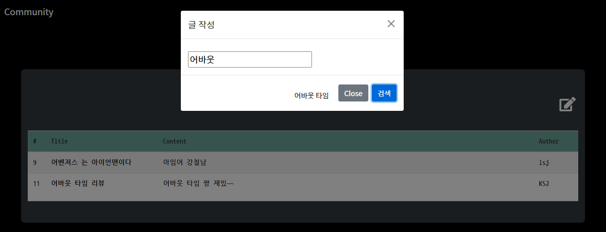
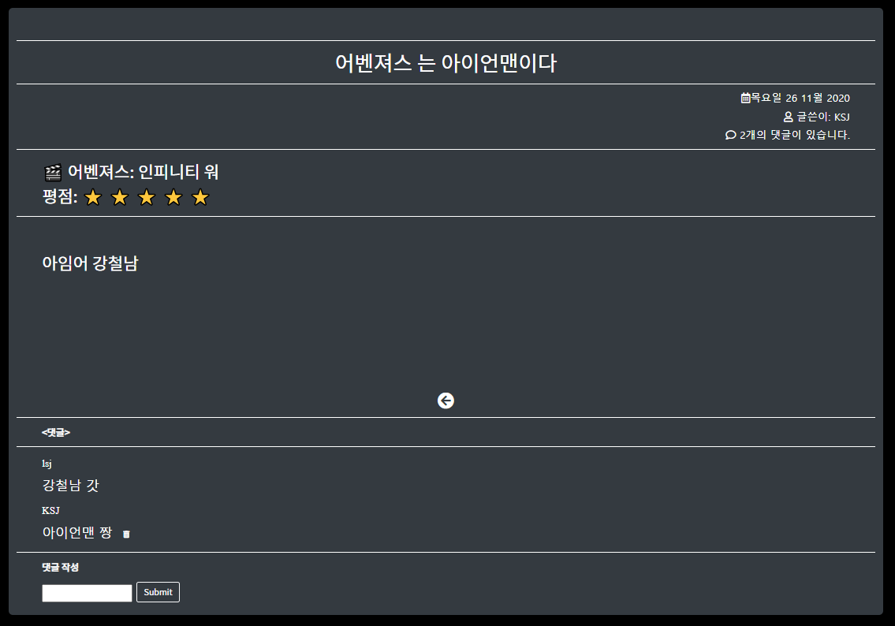
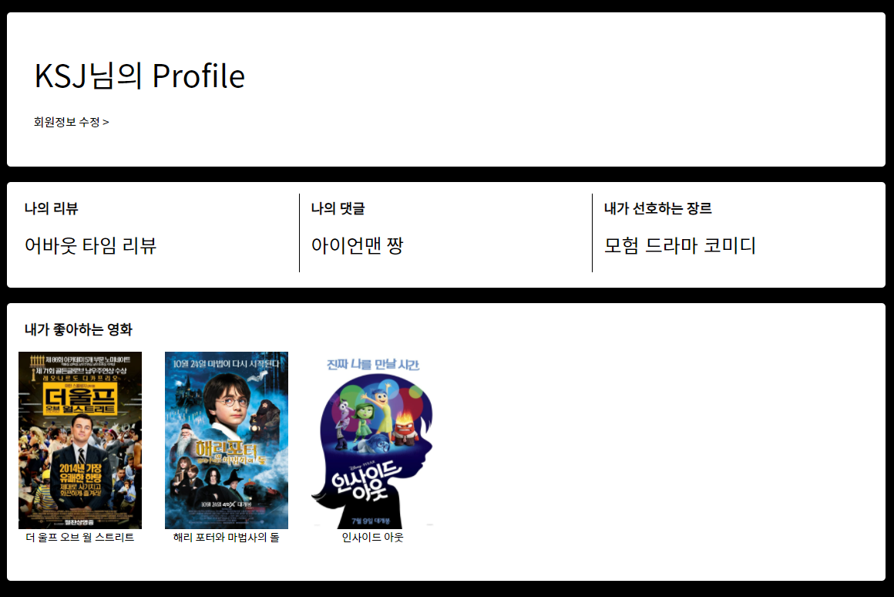

# Final Project

> 영화 정보 제공 및 리뷰 작성 커뮤니티 사이트 제작 프로젝트
>
> 배포 주소: http://127.0.0.1:8000/movies/


[toc]

## 1. 홈페이지 사진



<br>


## 2. 주요 기능

<br>

### 1. 영화 추천 알고리즘

>  사용자가 좋아요를 누른 영화의 장르를 기반으로 3개의 영화를 추천해주는 알고리즘

사용자가 로그인 후 좋아하는 영화에 '하트' 버튼을 누르면 그 영화의 장르 id를 저장하여, 장르별 좋아요 개수가 가장 많은 장르 3개를 담는다.

popularity 1~10위까지 영화 중 담아놨던 장르 3개에 해당하는 영화 3개를 랜덤으로 각각 뽑아내서 홈페이지에 띄운다. (10개 중 랜덤으로 3개를 띄우는 방식)

```python
# movies/views.py

 genres ={ 
        '1' : 0,'2' : 0,'3': 0,'4': 0,'5': 0,
        '6': 0, '7' : 0, '8': 0, '9':0, '10': 0,'11' : 0,
        '12': 0, '13': 0, '14': 0, '15': 0, '16': 0,
        '17':0,'18':0,'19':0
    } #장르 테이블에 맞추어서 딕셔너리 구성 
    like_genres = []
    recommand = []
    if request.user.is_authenticated:
        user = request.user
        print(user.like_movies)
        # print(Movies.objects.all())
        for movie in user.like_movies.all():
            for genre in movie.genres.all():
                # print(genre.id)
                genres[str(genre.id)] +=1
        top_3 = sorted(genres.items(), reverse=True, key= lambda x : x[1])[:3] # 선호도 가장 높은 3개
        if top_3[0][1] != 0:
            for i in range(3):
                like_genres.append(top_3[i][0])
            for movie in Movies.objects.order_by('-popularity'):
                if len(recommand) ==10:
                    break
                for genre in movie.genres.all():
                    # print(genre.id)  
                    if (str(genre.id) in like_genres) and (movie not in recommand) :
                        recommand.append(movie)
    # recommand = list(set(recommand))[:3]
    random.shuffle(recommand)
    context = {
        'first': first,
        'second': second,
        'third': third,
        'recommand': recommand[:3]
    }
```

<br>


### 2. DB 영화 검색

>  검색창에 영화 제목을 검색하면 검색어를 포함한 영화 목록이 결과로 나온다.


JS로 구현하였고, axios를 이용해 Django 서버로 요청을 보내 결과들을 출력하였다.

JS로 결과를 출력하기 위해 아래처럼 태그들을 하나 하나 만들고, 속성을 부여하는 과정이 필요했는데 처음엔 이런 방식이 맞는건가 의심스러울정도로 약간의 노가다(?)였다... JS 쉽지 않은거였구나..!

```html
for (const movie of resultArray) {
    const posterDiv = document.createElement('div')
    const posterAtag = document.createElement('a')
    const posterImg = document.createElement('img')

    searchResult.appendChild(posterDiv)

    posterDiv.setAttribute('class', 'col-md-4')
    posterDiv.appendChild(posterAtag)

    posterAtag.appendChild(posterImg)
    posterAtag.setAttribute('href', `${movie[1]}`)

    posterImg.setAttribute('src', movie[0])
    posterImg.setAttribute('class', 'poster-size')
    posterImg.setAttribute('class', 'poster-size')
}
```


검색 후 다시 다른 검색어로 검색을 할 경우 결과 목록을 지우고 새로운 검색 결과를 보여주어야 한다. 이를 위해 아래처럼 자식요소를 모두 지워주는 방법을 사용했다. (while문 사용)

```html
while (searchResult.firstChild) {
	searchResult.removeChild(searchResult.firstChild)
}
```

<br>


### 3. Community

> 영화에 대한 리뷰를 작성하고, 그에 대한 목록들을 확인할 수 있다. 각각의 리뷰에 댓글을 작성하고 삭제할 수 있다.

1. review 작성

   - 새로운 글 작성 버튼을 누르면 modal이 뜨는데, 여기서 영화 제목을 검색하고 클릭하면 해당 영화에 대한 리뷰를 작성할 수 있다.

     

2. 댓글 기능

   - 리뷰에 댓글 작성하고 삭제할 수 있는 기능

     


<br>

### 4. 회원정보 관리

> 홈페이지에 가입하고 로그인하면 My page에 들어갈 수 있다. My page에서는 자신이 작성한 리뷰와 댓글, 선호하는 장르 3가지, 좋아요를 누른 영화 목록들을 볼 수 있다.
>
> 

<br>


## 3. 배포

aws를 이용해 배포를 완료하였다. 힘든 과정이었지만 배포를 하고나니 다른사람에게도 사이트를 보여줄 수 있고, 배포 과정을 이해하는데 도움이 되었다.

배포 주소: http://3.35.166.99/movies/

<br>


## 4. 문제점 및 해결 방법

1. JS의 a태그 href 속성 부여 방법

   DB 영화 검색 기능에서 JS를 이용해 a태그의 'href' 속성에 movie detail 페이지 주소를 넣어주어야 했는데, 기존 방식인 ``이 통하지 않았다.  백틱과 $를 사용해도 되지 않았다. 그러다가 그냥 아래처럼 movie의 pk만 백틱으로 감싸서 넣어주게 되었는데, 그랬더니 알아서 a태그의 주소가 `http://127.0.0.1:8000/movies/179`이런식으로 생성이 되었다! 놀라운 일이었다...

   ```js
   posterAtag.setAttribute('href', `${movie[1]}`)
   ```


2. input 태그의 name 속성

   django 에서 제공하는 form을 사용하지 않고 bootstrap의 form을 사용하는 과정에서 회원정보 수정이 되지 않는 문제 발생

   - input의 name에 field명을 써주지 않아서 발생한 문제였다.
   - name에 필드명을 써주어야 form에 값이 들어간다!

<br>


## 5. 아쉬운점

1. 반응형 디자인을 하지 못했다.
   - 처음 계획은 반응형도 구현하는 거였는데ㅠㅠ ''레이아웃 잇' 사이트를 이용해서 틀을 잡아놓고, 나중에 한번에 반응형을 구현하자고 계획을 세웠지만 시간부족으로 이를 구현하지 못했다😪 그래서 모바일에선 다 깨지는게 아쉬웠다ㅠㅠ
     - https://www.layoutit.com/ : 부트스트랩 레이아웃 코드를 짜주는 사이트! 여기서 생각한 레이아웃대로 코드를 가져오면 편하다.
2. 스타일링에 더 신경을 쓰지 못했다.
   - 처음엔 스타일링에 굉장히 많은걸 시도해보고 싶다는 계획을 세웠지만, 시간 부족으로 점차 하나씩 포기했다... 나중엔 그냥 깔끔하게만 하자는 생각으로 css를 했고, 이마저도 모든 페이지를 완벽하게 꾸미진 못한 것 같아 아쉬움이 남는다ㅠㅠ

<br>


## 6. 느낀점

1. 하나의 사이트를 만드는데는 굉장히 많은 노력이 필요하다.

   - 처음에 가볍게 생각하고 프로젝트를 진행했다가, 나중에 갈수록 시간이 매우 부족함을 느꼈다. 처음 계획은 멋진 기능도 넣고, 스타일링도 예쁘게 하고 싶었는데 갈수록 시간 부족으로 포기하는 것이 점점 늘어났다😥

2. 프론트엔드는 한 사람이 맡는 것이 좋은 것 같다.

   - 우리는 프론트엔드/백엔드 구분 없이 두명 다 같이 했는데, 이렇게 하니 사이트 디자인의 통일성이 부족했다. 내가 맡은 홈페이지와 회원 정보 관리, 회원정보 수정 및 비밀번호 변경 페이지는 검은색과 흰색을 이용한 디자인을 추구했는데, 페어가 맡은 커뮤니티는 민트색과 회색을 이용한 디자인을 추구하였다.
   - 프론트엔드를 한 사람이 다 하거나, 아니면 처음에 UI 설계를 페이지별로 세세하게 같이 구성해놓고 그거대로 페이지를 구현하는 방법이 좋은 것 같다.

3. JS는 어렵다...

   - 새로고침 없이 구현해야 할 기능들은 JS를 이용했는데 굉장히 귀찮은 일이었다😂 특히 DB 검색 기능 구현에서... 태그들을 하나하나 만들어주면서 쉽지 않음을 느꼈다..

4. 다른 사람의 코드를 참고하는 능력도 키워야 한다.

   - 내가 모든 코드를 새로 짤 수는 없기에 다른 사람의 코드를 참고해야 하는데, 이것도 쉽지많은 않다. 다른 사람의 코드를 내 것에 적용시키는 연습이 필요하다.

5. 스타일링은 굉장히 어렵고 시간이 많이 든다.

   - 처음엔 애니메이션도 잔뜩 넣고 깔끔하고 예쁘게 꾸미고 싶었는데, 시간 부족으로 실현하지 못했다.. 그래도 최대한 깔끔하게 스타일링 하려고 노력했는데, css로 스타일링 하는 것은 쉽지 않았다. 
   - 스타일링을 예쁘게 하려면 다른 사이트들을 많이 참고해보는 것이 좋은 것 같다. 다음엔 템플릿도 사용해보고, 애니메이션 기능도 구현해보아야겠다.
   - 기능이 아무리 많은 사이트여도 UI가 부족하면 별로여 보인다는 걸 깨달았다. 스타일링은 매우 중요하다!!

6. 페어와 함께 프로젝트를 진행하면서 협업을 배웠다.

   - 하루짜리 프로젝트가 아닌 몇일에 걸친 프로젝트는 처음 해보았는데, 페어와 함께 모든 것을 결정하고 구현해내야하는 과정에서 협업을 배울 수 있었다.
   - 서로의 아이디어를 공유하고, 이를 적용시키는 과정도 매우 중요하다. 프로젝트 초기에 아이디어를 내서 계획을 세세하게 세우는 것이 굉장히 중요함을 느꼈다.
   - 이번 프로젝트에서는 Trello를 활용하지 못했는데, 그래서 단계별로 해야할 일들을 체계적으로 정리하지 못한 것 같다. 계획 없이 생각나는대로 프로젝트를 한 점에서는 약간의 아쉬움이 남는다.
   - git을 활용하여 프로젝트를 진행했는데, 처음에는 db를 같이 올려서 merge하는 과정에서 계속 충돌이 났다. 충돌을 해결하지 못해서 파일 다 지우고 다시 pull 받는 과정을 몇 번이나 한지 모르겠다😅 이후에는 db를 빼고 push하였고, pull 받은 뒤에 db파일을 따로 넣어주는 방식을 사용해 충돌을 줄일 수 있었다. branch도 매번 해주어야하는게 익숙치 않았는데 이번 프로젝트를 통해 조금은 익숙해진 것 같다!

7. 배포

   - 민교쌤의 배포 수업을 들으면서 배포를 하였다. aws를 이용하였고, 배포 과정이 매우 험난하였다ㅎ 오류가 계속 났는데 하나하나 다 봐주신 민교쌤 정말 감사합니다....
   - 배포 과정은 힘들었지만, 배포 하고 나니 뿌듯하였다! 이제 다른 사람에게도 보여줄 수 있게 되었다😊

8. 마지막으로...

   프로젝트 하느라 많은 시간을 투자하고, 하루종일 코딩을 해야 했지만 내가 사이트를 만든다는 점에서 매우 재미있었다! 결과물을 볼 때 뿌듯하기도 하고, 특히 프론트엔드에서 재미를 느낄 수 있었다. 다음 프로젝트에선 스타일링에 더욱 신경 써서 완성도 있게 프로젝트를 마무리하고 싶다.