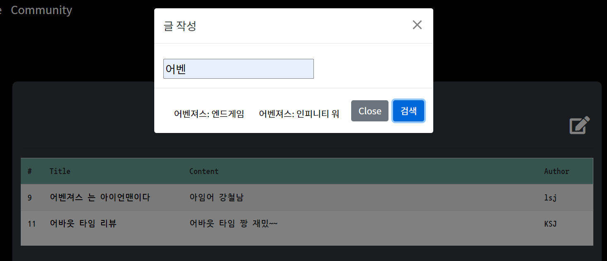
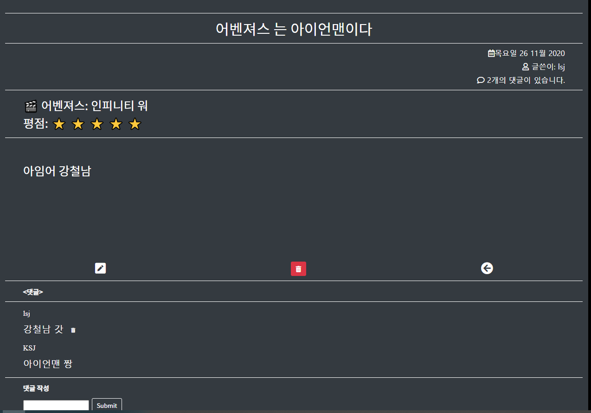

# README

```bash
localhost:8000/movies/tmdbdata/ 를 통해 db데이터를 입력할 수 있습니다.
```


## 데이터 수집 및 가공 

### 1. 데이터 수집 API

- TMDB(https://www.themoviedb.org/documentation/api)

- top_rated 기준으로 영화정보를 제공받아 django seed data로 활용

  ```python
      g= {
          28 : '액션',
          12 : '모험',
  				.....
          10752 : '전쟁',
          37 : '서부',
          36 : '역사',
      } # 영화 장르 코드 
  
      for genre_name in g.values():
          gerne_instance = Genre()
          gerne_instance.name = genre_name
          gerne_instance.save()
  		.....
   
      for i in range(1,11): # page 1~10 => 총 10개 페이지 
          params = {
              'api_key' :"645b9138c68a71f1de281e4ae381a8b4",
              'language' : 'ko-KR',
              'page' : i,
              'region' : 'KR',
          }
          res = requests.get(BASE_API,params=params).json()
          results = res['results']
          for j in range(20): 
              movie_instance = Movies() # Movies 인스턴스 
  					......
              movie_instance.poster_path = poster_path
              movie_instance.save()
              for gerne in genres: 
                  gerne_instance = Genre.objects.get(name=gerne)
                  movie_instance.genres.add(gerne_instance)
          # for k in range(len(model)):
  ```

  **<문제점>**

  - ManyToMany 관계를 정확히 이해하지 못한 결과, django에서 어떻게 만들어주어야하는지 오래동안 헤맸다.
    - `user.genres.all()`: 유저가 좋아요한 영화 장르들 → 역참조 - M:N   
    - 이러한 관계를 통해 유저가 좋아요한 영화 장르들을 저장하고 역참조를 통해 추천 알고리즘을 만들었다.
  
  
  
  # 2. 데이터베이스 모델링(ERD)
  
  

- ERD 첫 구상과 달리 많은 구조 변화가 있었다. 처음부터 어떻게 관계를 잘지어야 나중에 웹에서 데이터를 다룰 때  편하다는 것을 제대로 느낄 수 있었다. 

- many-to-many 관계의 유용성은 정말 좋았다. 중계 테이블을 만드는 것이 처음에 어려웠지만 한 번해보니 좀 더 데이터 베이스 관계를 이해할 수 있었다.

  

  # 화면 설계(UI)

  - 카카오 오븐을 통해 설계 

  

   **[첫 구상도]**

  

  **[실제 구현]**

  위와 같이 실제 예상과는 달랐지만 UI요소가 실제로 해보면서 계속 고치게 되는 것 같다. 전체적인 느낌만 구성하고 지속적인 수정을 통해 완성도를 높여가는 방식으로 프로젝트를 했다. 

  다음 웹 프로젝트는 좀더 UI와 효과에 신경을 두고 싶다.

  ### 영화 상세페이지

  

  - 주요 기능으로는 `❤좋아요` 버튼을 통해 추천 알고리즘 데이터를 모으는 것과 Youtube API를 통해 예고편을 제공 하였다. 

    ```python
    def youtube(title):
        url = 'https://www.googleapis.com/youtube/v3/search'
        params = {
            'key' : settings.YOUTUBE_API_KEY,
            'part' : 'snippet',
            'type' : 'video',
            'maxResults': '1',
            'q' : f'{title} trailer' 
        }
        response = requests.get(url,params)
        response_dict = response.json()
        return response_dict
    ```

  

  ### 영화 검색 기능

  1. 장르별 검색 

     

  2. 영화 제목 검색 

     

  ### 커뮤니티 기능

  



- Modal 기능을 사용하여 검색기능을 통한 글 작성

```python
# @require_POST
def search_title(request, title):
    print(title)
    movies = Movies.objects.filter(title__contains=title)
    # print(movies.object.all())
    data = {
        "movies" :movies
    }
    return JsonResponse(list(movies.values()),safe=False)

```

- 또한 댓글 작성 및 글 삭제 수정 기능을 더했다. 
- 아쉬운점⚡ : 댓글 수정기능이 생각보다 쉽지 않았다. Javascript를 활용하여 페이지 리로드 없이 할려고 했지만 잘되지 않아 기능을 뺴고 프로젝트를 수행했다. 추후 댓글 수정 기능을 넣을 것이다.


---

## 느낀점 🚗

- 풀스텍으로 ERD부터 css까지 하면서 부족한점을 많이 느꼈다.
- 사이트를 만들어보면서 사이트에 기능을 만들 때마다 부족함을 찾고 개선하면서 많이 배울수 있었다.
- javascript와 css를 더 공부해서 멋진 web을 만들고 싶다는 욕심이 생겼다.🌊