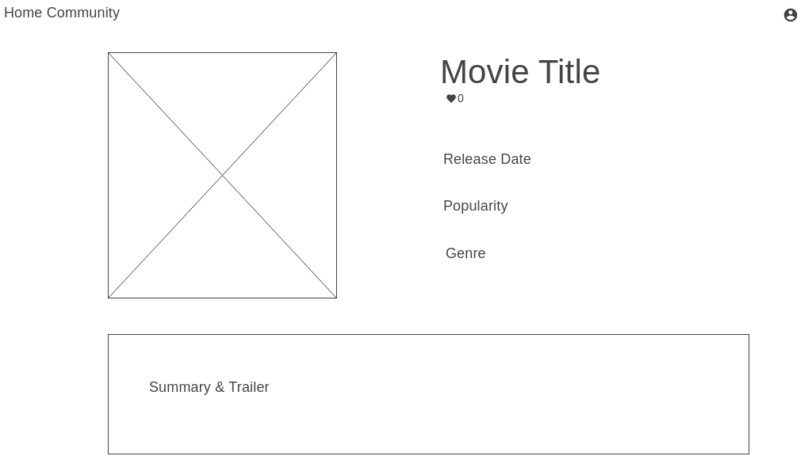
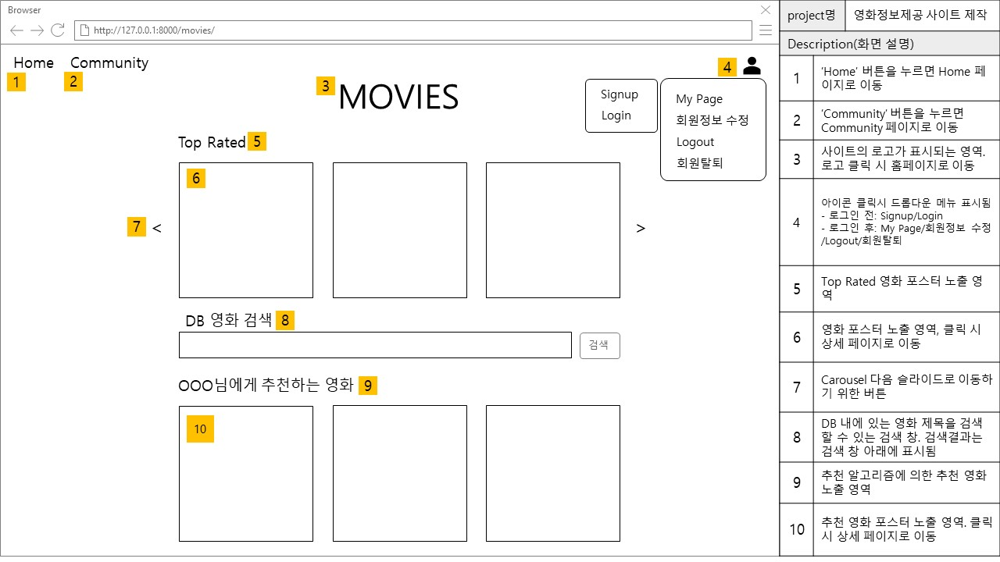
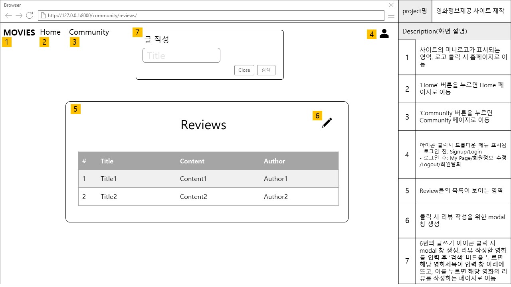
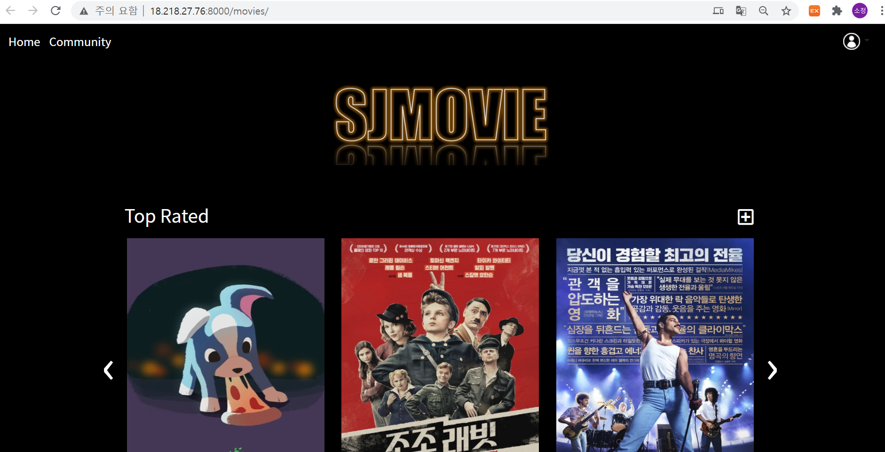

# Day01 과제

> 1학기 종합 PJT를 재가공하여 소프트웨어 개발 방법론의 '설계', '유지보수' 단계를 수행함

## 1. 설계

#### 1. Wire Frame 화면 설계

> 사용 툴: https://wireframe.cc

- Home page

  

- Detail page

  

- Profile

  

#### 2. Story Board 작성

> 사용 툴: PPT

- Home page

  

- Detail

  

- Profile

  

- Review 목록 페이지

  

- Reivew 작성 페이지

  

## 2. 배포

> 1학기 종합 PJT를 AWS 서버에서 EC2 서버를 발급 받아서 배포

- 배포 주소: http://18.218.27.76:8000/movies/

- gunicorn, Nginx로 서버 운용

